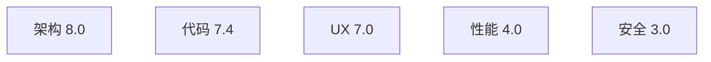

# 一个"教科书级 + 真实坑级"的 WebApp 技术解剖

> 副标题: 五位虚拟专家的盲审报告与背后的工程哲学
>
> 日期: 2026-05-30 · 评审分支: master @ `6783b0f` · 全文 ~11k 字

---

## 引子: 我们看到了什么

把五位专家的盲审分数摆在一起,你会看到一张反差极大的雷达图:

| 维度 | 评审人 | 分数 |
|------|--------|------|
| 架构 | 系统架构师 (前 AWS 首席) | **8.0 / 10** |
| 代码质量 | Staff Engineer | **7.4 / 10** |
| UX/产品 | 前 Notion PM | **7.0 / 10** |
| 性能 / SRE | Netflix 级 SRE | **4.0 / 10** |
| 安全 | OWASP 红蓝队 | **3.0 / 10**(合规等级 D) |

一句话定调:**这是一个被认真想过的"轴"撑起来的系统,在能用脑子解决的维度上拿了高分(架构、代码、UX),在需要"工程纪律 + 时间"去打磨的维度上(性能、安全)摔得很惨**。

它不是一个"做得平庸"的项目,而是一个**典型的"1-2 个高手 + AI 辅助"产物**——某些地方比中型 SaaS 公司还干净,某些地方让红队 5 分钟就能拿下管理员权限。这种参差正是它值得讲的原因。

接下来我们逐章拆开看。每章末尾有一行"读者可以从这里学到什么",这是写给同行的便条,不是给作者的成绩单。

---

## 第 1 章 — 架构: 一招漂亮的抽象,撑起整片江山

如果你做过工单类系统,八成踩过这样一个坑: 业务方提一个新需求,"给攻关单加一个'CCB 评审时间'字段"——后端要改表(`ALTER TABLE`)、改 ORM 模型、改 router、改 DTO、改前端 Form,顺手写个 migration script,出错还要 rollback。一周过去了。

这个项目把这件事压成了**"改一个 JSON 文件,一分钟"**。

### "Node + properties JSON" 是个什么聪明的赌注?

它整个领域模型就六张表:

```ts
// apps/backend/src/db.ts:9-37
nodes      (id, nodeType, properties JSON, search_text, created_at, updated_at)
edges      (id, edgeType, sourceId, targetId, properties)
progress_log
audit_log
proposals
notifications
```

注意,**没有** `attack_tickets`、没有 `persons`、没有 `contributions`。所有 18 种业务实体——攻关单 / 人员 / 贡献 / 团队贡献 / 信息卡片 / 领域 / 值班 / 权重文件 / 发布包 / P3 事件 / 5xx 问题 / 400 问题 / 变更单 / 经验 / 日任务 / 事件追踪 / 邮件组 / 告警治理——**全部塞在 `nodes` 这一张表里,靠 `nodeType` 字段区分,业务字段进 `properties` JSON**。

这是个**赌注**: 赌的是"我能用 JSON 容器 + 应用层 schema 校验,代替传统关系范式"。

绝大多数团队不敢这么赌,因为它意味着两件事:

1. **JSON 列不能像普通列那样建索引** —— 性能潜在风险(果然这是后面性能评审 4 分的根源)
2. **类型约束从 DB 移到了应用层** —— Schema 系统必须自己实现,而且不能崩

但赢面也清晰: **配置驱动**。`config/schemas/attackTicket.json` 描述了"攻关单有哪些字段、哪个 ref 哪个 anchor",运行时 `SchemaRegistry` 加载;**加字段 = 改 JSON,不需要 DDL**。已经攒到 18 个 schema 文件了,通用 CRUD 一组 `/api/nodes/:nodeType` 路由覆盖所有 18 种实体,新增 nodeType **零代码改动**。

这就是"一个数据模型,多个视图"的工程化表达。攻关作战台、人员名册、贡献排行、团队荣誉——表面上看是 N 个独立页面,底下都是同一张 `nodes` 表的不同 nodeType 投影。

### KG 派生模型: 真源 + 衍生的哲学

更聪明的是**"结构化是权威、KG 是派生"**这一刀。

业务节点是真源,所有写操作都进 `nodes`/`edges`。**知识图谱(KG)从不接受直接写入**——它是从结构化数据**派生出来的**。派生边只有四种:

```ts
// apps/backend/src/kg-rebuild.ts:8
DERIVED_EDGE_TYPES = ["REF", "ANCHORED_TO", "CONFLICTS_WITH", "OVERLAPS_WITH"]
```

任何时候你可以 `POST /api/kg/rebuild`,**全擦掉,全重算**,原始数据零损失。这是一个非常稳健的设计:派生数据是无状态的,可重放的。

最让架构师拍案叫绝的是 **ANCHORED_TO 锚节点**模式。同一个"问题单号 PB-FH-001"可能在攻关单、信息卡片、5xx 问题三张不同的 nodeType 里各出现一次——传统做法是用字符串外键硬绑,跨视图查询全是 `LIKE '%PB-FH-001%'`。这里的做法是:

- 写边时 (`anchors.ts:12-24`) 自动在 `nodes` 表里建一个 `{ key: "PB-FH-001" }` 的锚节点,然后用 `ANCHORED_TO` 边把三个业务节点都连过去
- BFS 遍历时 (`related-core.ts:42-56`) **穿过锚节点但不 emit 它** —— 用户看到的是"这三个业务节点是关联的",看不到中间的锚
- KG 全量 rebuild 后 (`kg-rebuild.ts:43-49`) **无入边的锚节点自动 GC**,不会污染查询

这其实是 RDF/Triple Store 里的 **blank node** 思想,用关系表 + JSON 重新实现了一遍。如果你熟悉 OWL/SKOS,你会看出这是裁剪过的工业级实现:用最少的概念引入,把"跨视图同指代"的真问题解决了。

### 代价: 不是 9 分而是 8 分

架构师给的不是 9,是 8。两个隐忧:

**一是单文件装配**。`createApp({ repo, registry, mailSender })` 注入式装配本身是教科书做法,但 `app.ts` 一口气挂载了 **34 个 router**。可读阈内,但已经在边缘——再多加几个 feature,这文件就要拆。

**二是"配置驱动"的破口子**。理想是"所有业务规则都通过 schema 表达",现实是有些规则太特殊——比如 `gradeGate` 函数(`routes.ts:94-102`)给"贡献等级"字段做了 leader/admin 权限门控,这种"特定字段的特殊权限"目前是硬编码在 routes.ts 里,而不是在 schema 里声明 `permission: "leader+"`。每加一个"特权字段"都要改 routes.ts。

这正是配置驱动系统的**永恒张力**: 你想让 100% 业务规则可配置,但总有 5% 的规则会顽固地特殊化。架构师给的建议是把这 5% 也"声明化"——在 schema field 上加 `permission` 标记,通用 middleware 统一处理。

> **★ 读者可以从这里学到什么**
>
> 何时该选 schema-less + 应用层?——业务实体多但结构相似、需求频繁变动、规模在中等(<10 万节点)、团队接受"性能换灵活"的赌注时。
>
> 何时该选 strict ORM + DDL?——实体少而稳定、跨表 join 是核心、数据量大、需要 DBA 介入做物理设计时。
>
> 这俩选择没有谁更"对",是赌不同的东西。本案赌赢了"演进速度",赌输的部分(查询性能)会在第 4 章付账单。

---

## 第 2 章 — 代码质量: AI 时代的"高纪律 + 高产出"长什么样

Staff Engineer 给的 **7.4 分**很有意思——后端和共享层稳定在 Senior(L5)区间,前端在 Mid-Senior(L4)区间,而**写文档 + 反思自己工作过程的能力**已经到了 Staff(L6)。

我们先看几个数据:

- **后端**: 5,998 行 / 56 文件,中位文件 ~83 行,最大 448 行
- **前端 v2**: 12,343 行 / ~80 文件,最大 1,065 行
- **后端测试**: 5,535 行 / 60 文件 / 344 个 `it()` —— **测试/代码 行数比 92%**,几乎 1:1
- **前端 e2e**: 6,957 行 / 41 文件 / 396 个 `test()` —— 但**前端单测: 0**
- **445 个 commit**,全部规范的 `feat(模块):` / `fix(模块):` 格式
- **0** ESLint、**0** Prettier、**0** GitHub Actions、**0** pre-commit hook

读懂这串数字需要点想象力: **这像不像一个"自我要求极高但缺少团队协作约束"的产物**? 我们一会儿讲为什么。

### CLI = HTTP API 的等价路径

最值得抄的是这条工程纪律: **每个后端 HTTP API,必须有一个对应的 CLI 命令**。CLAUDE.md 把它写成了 definition-of-done:

> CLI 是 agent 驱动系统的方式。当实现 ANY 新的后端 API 时,同步实现它的 CLI 命令——这是后端的完成定义,绝不延后。

实现方式优雅:

```ts
// apps/backend/src/cli-core.ts
export interface CliCommand {
  name: string; summary: string; usage: string;
  build: (pos: string[], opts: Record<string, string | boolean>) => HttpRequest;
}
```

每个 CLI 命令就是 `(pos, opts) => HttpRequest` 的纯函数。整个 CLI 是一张**纯声明式表 + 注入式 `HttpFn`**——可以单测、零网络耦合、零状态。它不是"CLI 调一下 HTTP",它是"CLI 和 HTTP 描述的是同一件事的两种表达"。

为什么这件事重要? 因为它把"agent-operable"做成了工程纪律,而不是一个"将来我们要支持的特性"。一旦 LLM 想要调用这个系统,它不需要发明任何新接口——CLI 就是 LLM 友好的 HTTP API。

### 路由工厂 + 显式 DI: 反 NestJS 的隐式装饰器

如果你写过 NestJS,你知道 IoC 容器 + 装饰器 + Module 系统会带来一个隐患: **隐式依赖** —— 一个 controller 注入了什么、provider 从哪来,要看四五层装饰器拼接才能拼出来。

这里的做法极度反这种风格:

```ts
// apps/backend/src/app.ts
app.use("/api", makeRouter(deps.repo, deps.registry));
app.use("/api", makeImportRouter(deps.repo, deps.registry));
// ... 30+ 个 makeXxxRouter,全部接收同一组依赖
```

没有任何全局单例。`createApp({ repo, registry, db, mailSender })` 是测试与生产同构的入口。`test/helpers.ts` 的 `makeTestApp()` 用 tmpdir + in-memory schema 构造完整应用栈,**不需要 mock**——这是 Express 项目里少有的"测试就是完整运行起来的应用"的实现。

### 测试 1:1 的"反常"

测试 5535 行 vs 代码 5998 行,这个比例之高,如果你做了 5 年以上项目你会立刻警惕: **不是冗余 test 就是 over-engineering**。

但实际看下去,后端 344 个 `it()` 覆盖每个 router 工厂的每个端点,前端 396 个 e2e test 覆盖每个页面的列表/筛选/CRUD/导出。这不是为了 KPI 凑的覆盖率,是真正用 e2e 跑过的功能。

为什么能做到? 因为前面提到的**测试与生产同构**——`makeTestApp()` 就是 `createApp()` 的薄薄一层封装,没有 mock 大山要爬,写 test 跟写代码一样快。

但是,这里也有**红线**:

- **`makeTestApp` 散落 4 个版本**: `test/helpers.ts` 一个标准的、`merge.e2e.test.ts:13-17` 自己抄一份用真实 CFG 目录、`rbac.e2e.test.ts:13-15` 又抄一份、`automation.e2e.test.ts:14-17` 再抄一份。这造成"修了 helper 的人不知道 3 处复制粘贴的存在",DRY 红线已经被踩。

### 但是: 前端 0 单测 + 1065 行巨型组件

到了前端,纪律明显掉一档。

**`AttackDetail.tsx` 1,065 行**,18 处 `any`。这个文件一个人干了八九件事:

- 攻关单详情展示
- 状态流转
- 进展记录
- 编辑表单
- 求助网络树
- 日报
- 动态 Tab
- 关系图侧栏
- 找帮手推荐

20+ 个 `useState` 同居:`editOpen` / `editForm` / `editSubmitting` / `transitionOpen` / `transForm` / `transSubmitting` / `progressOpen` / `progForm` / `progSubmitting` / `drModalOpen` / `drForm` / `drSubmitting` / `supportModalOpen` / `supportForm` / `supportSubmitting` / `addTabOpen` / `visibleCards` ...

每个抽屉一组 state(open / form / submitting),复制粘贴七八次。**这种文件最大的问题不是难读,是难改**——你想拆它,但没有单测托底,拆完不知道有没有破其他抽屉。所以每次只敢"再加一行",再加一行,直到 1065 行。

更重要的是**架构师在"解耦"维度只给了 7 分**(前端 5.5、后端 7.5、平均 7)。后端是教科书级解耦,前端因为巨型组件 + `api.ts` singleton 把 50+ 端点全包了,平均下来掉了 2 分。

### `as any` 在最底层

类型安全在最薄弱处——`repository.ts` 内部 14 处 `as any` 拿 sqlite 行:

```ts
const r = this.db.prepare(`SELECT * FROM nodes WHERE id=?`).get(id) as any;
return { id: r.id, nodeType: r.nodeType, properties: JSON.parse(r.properties), ... };
```

如果你新增一列忘了改这里,TypeScript **不会报错**——`as any` 让你拿到 `undefined` 直到运行时炸。

这是整个项目类型安全最薄弱、**也是修起来最便宜**的地方——半小时定义 6-7 个 `NodeRow / EdgeRow / ProgressRow` interface,问题解决。它没修,纯粹是因为"还没踩坑就还没想起来要修"。

### 一个观察: AI-driven 开发的典型画像

Staff Engineer 在结语里有一段话特别值得引用:

> 这个项目极有可能是 "1-2 个高手 + AI 辅助"的产物。代码风格高度一致、文档密度反常地高、commit message 全部规范、测试比例反常地高(1:1 行数比) —— 这些特征不像传统团队,更像有纪律的 AI-driven 开发。

证据是什么? 看 CLAUDE.md(36KB)+ AGENTS.md(64KB)+ docs/(684KB)。这是"宪法级"的项目文档,把每一条 hard-won 的经验显性化:

- Ant Design 5 自动在 2 字符中文按钮间插空格 → 用正则 `/导\s?out/`
- AntD Select 下拉是 portal,必须 `dispatchEvent('click')` 不是 `.click()`
- 贡献等级 RBAC: X-Role 缺失 = 信任,普通 = 403,"测试时用 `localStorage.setItem('combat-role', 'leader')`"

正常人类团队**不会写这种文档**——人类是"踩了一次就记住了,下次注意"。AI 不会"记住",所以必须把所有坑显性化成 SOP。这是 AI-driven 开发的**标志性病灶**: 文档密度反常地高,因为它是"上下文"。

> **★ 读者可以从这里学到什么**
>
> 一个不到 6,000 行的后端,搭配 5,500 行测试 + 64KB AGENTS.md,跑得起来 124 个路由 + 18 种业务实体——这是工程纪律能撑起的上限。但 **0 个 ESLint、0 个 CI**,意味着"质量门"完全靠人/agent 自觉。一旦扩到 5 人团队,这道门当天就破。
>
> 借鉴的是: 测试与生产同构的 `makeTestApp()`、CLI = HTTP API 等价、structured logging 命名规范。要补的是: 加最薄的 ESLint + Prettier + 一条 GitHub Actions(半天工作量),让"agent 跑出来的代码"也走同一道门。

---

## 第 3 章 — UX/产品: AI 助手只在一个页面挂着的悲剧

前 Notion PM 给的 **7.0 分**有一段非常致命的话:

> HermesChat 设计本身漂亮(可拖拽悬浮 / 引用溯源 / Markdown 渲染 / Tag 跳转),**但只在 KGGraph 一处挂载**。攻关详情页没有挂!Dashboard 没有!这是产品最大的暴殄天物。

`grep "<HermesChat"` 全代码库就一处命中: `KGGraph.tsx:387`。这是一个 5% 用户会访问的二级菜单页。

把产品最强的差异点埋在最不显眼的位置,这是教科书级的产品错误。但有意思的是,作者**显然知道 Hermes 是杀手锏** —— `hermes-agent.ts` 的引用回查防幻觉机制写得非常工整,后端 Hermes Runner 还在 boot 时 `warmup()` 预热 opencode serve。**后端把 Hermes 当亲儿子,前端把它扔到了角落**。这种"后端用心、前端将就"的错位,是后面我们要反复看到的本项目签名 pattern。

### 列表打磨胜过 Linear 的细节

但是,如果你以为这是个"UX 一般"的项目,你就低估了它。

PM 评审单独列出了 **5 个"惊艳细节"**,我挑两个最能体现 craftmanship 的:

**1. 关注行的双视觉编码** — `AttackList.tsx:380`:

```tsx
style={{ background: '#fffbe6', boxShadow: 'inset 3px 0 0 #fadb14' }}
```

淡黄底 + 内嵌左侧金条。在"全部" Tab 里,你关注的攻关单一眼可辨——比 Linear 那种"☆"图标列还友好,因为是整行编码不是单格编码。而且 favorites key 按 `username` 隔离(`favKey()`, line 32),换账号不串。这种细节是真的"用过这个产品的人才会做出来的优化"。

**2. 私密攻关单的全链路守卫** — 列表 + 详情 + URL 直访 + 后端 403,**四层闭环**:

- 列表行带 🔒 + 仅创建人可见删除按钮
- 详情页带 Tooltip 解释 + 创建人专属"管理私密授权" Drawer + 多选授权人/邮件组
- 用户直接拼 URL 访问别人的私密单 → 后端返回 403 → 前端跳"无权访问"专用页(`AttackDetail.tsx:205-216`)带 Lock 图标 + 返回按钮
- 后端 `routes.ts:73-83` 用 emailGroup × email × person 嵌套查找解析"私密授权组"成员(虽然性能堪忧,但功能扎实)

这种"前后端 + UI + 路由四层闭环"是真生产级的私密能力,Jira 和 Notion 都没做到这个程度。

### "以我为中心"Dashboard 缺位

但是,**真正的产品级失分**在 Dashboard。

`Dashboard.tsx` 当前是: 4 个 statistic + 最近活跃列表 + 状态分布柱条。这是一个**"团队总览"**视角的页面。

PM 一针见血:

> Linear 的 Home 是 "My Issues / Inbox / Active sprints",**永远以"我"为中心**。我们的 Dashboard 是"团队总览" → 对个人没有 ToDo 价值。
>
> 副作用: 用户登录后第一件事是 → 切到攻关作战台 → 找自己的 → 这个跳跃没有意义。

Dashboard 上**没有**:

- 分配给我的攻关单
- 我关注但有更新的
- SLA 即将超时(注意,后端有 escalation 机制,UI 没暴露)
- 待我审批

这是产品定位的问题不是工程问题。它有"团队总览"的资料(后端 dashboard.ts 一次扫 5 张表),没有"我的工作台"的资料。**而前者是 PM 的视角,后者是用户的视角**——两者不是同一件事。

### Kanban / Calendar 多视图缺位

第三个失分: 视图单一。Notion 的核心吸引力来自 Database View 可以一键切 Table / Kanban / Calendar / Gallery / Timeline,本项目只有 Table + Cards。

后端 Schema 已经支持(状态字段是已知枚举、时间字段是已知 ISO),技术债不大,纯粹是前端没做。Linear 的 Triage / Sprints 是 Kanban,PagerDuty 的 SLA 是 Calendar 倒计时——**多视图是这一品类的标配,不是 nice-to-have**。

### 菜单一级项 10 个

PM 在信息架构维度给了 6 分。一级菜单 10 项: 作战态势 / 攻关管理 / 人员与荣誉 / 求助中心 / 文档中心 / 全局搜索 / 知识图谱 / 问题反馈 / 帮助中心 / 系统管理。Linear 4 项,Jira 6 项。

而且面包屑组件 `PageBreadcrumb.tsx` 是**硬编码 ROUTE_MAP**,缺 `/documents`、`/manual`、`/kg`、`/users`、`/op-log`、`/backup` 多个路径——这些页打开后没有面包屑。这与"Schema 驱动"的产品哲学**矛盾**: 一个号称配置驱动的项目,导航却是手动维护的一张表。

> **★ 读者可以从这里学到什么**
>
> AI 助手不能只是"另一个 chat 入口"。Hermes 这种带引用回查能力的 agent 应该是**全站浮窗 + ctx-aware**——在攻关详情页问"找谁能帮我",自动带上 ticketId;在 Dashboard 问"我这周该做什么",自动带上 currentUser。
>
> 同样,"全员视图"和"我的视图"是两件事,不能混。一个团队工具的 Dashboard,默认应该是用户视角("我有什么要做的"),团队视角应该是 admin 才看的 ops 页。
>
> 这两条做完,UX 评分能从 7.0 跳到 8.5,商业化 demo 立刻可以打人。

---

## 第 4 章 — 性能: 当 SQLite 同步 API 撞上业务规模

Netflix 级 SRE 给了 **4.0 分**。最重要的一句话:

> 单进程 better-sqlite3 同步写 + 全表 JSON 扫描的"内存里跑业务"型架构;**对 < 5 千节点的内部小工具是恰到好处的工程权衡**,但**不具备任何水平扩展能力,且热点接口在 1 万节点量级就会肉眼可见地降级**。

这是一个"诚实评分"——4 分不是"差",是"在它的设计目标内合格,但天花板很低"。

### queryNodes 全扫 + 内存 filter: 5k 节点的临界点

最致命的单点在 `repository.ts:91-97`:

```ts
queryNodes(nodeType: string, filter?: NodeFilter): GraphNode[] {
  const rows = this.db.prepare(`SELECT * FROM nodes WHERE nodeType=? ORDER BY created_at DESC`).all(nodeType);
  let out = rows.map(r => ({ ..., properties: JSON.parse(r.properties), ... }));
  if (filter) out = out.filter(n => Object.entries(filter).every(([k, v]) => n.properties[k] === v));
  return out;
}
```

**filter 不下推 SQL**。每次调用都是"全表读 → JSON.parse 每一行 → 内存里 filter"。

这种代码有一个迷惑性的特征: **小数据集上看起来 OK**。1000 个节点,SQLite + better-sqlite3 同步 API 在内存里走一圈,30ms 不到。Page cache 还会让二次同样 query 极快。你跑 e2e、本地开发、demo,完全没感觉。

但它有两个隐藏成本:

**成本一: N 次 JSON.parse**。1 万个节点 = 1 万次 JSON.parse,**即便最后只命中 1 条**。Node.js 单线程,JSON.parse 是 CPU 密集型,1 万次大概 80-150ms。

**成本二: 全表读 + 内存 filter**,等于完全不用任何索引——`idx_nodes_type` 索引存在,但 `SELECT *` 把整个分区读出来,索引白建。

`grep queryNodes\(` 全代码库 **39 处调用**,横跨 22 个文件。热路径包括 dashboard、daily-report、escalation、reminders、conflicts、hermes 共 5 个后台扫描 + 用户请求。dashboard 一次加载至少扫 5 次全表:

> Dashboard 一次:`queryNodes(attackTicket)` + `queryNodes(contribution)` + `listAllProgress()` + `listConflictRows`(又一次 `queryNodes(attackTicket)`)+ `listProposals(...)`。 1 万节点 → 500ms-1.5s。

### "内存 filter 反模式"的识别特征

如果你正在 review 别人的代码,这种 pattern 有 **4 个特征**:

1. **Repository 方法签名只接受 nodeType,filter 是可选 JS 对象**(而不是 SQL fragment / WHERE builder)
2. **`SELECT * FROM xxx`** 后面没有 WHERE 子句的业务字段
3. **`.filter(...)` 在 JS 层调用**,谓词里访问 `properties.xxx`
4. **JSON 列存业务字段** 但没有 generated column / GIN 索引

任何一条命中两项以上,你都该警觉。这种 pattern **永远在小数据集 OK,永远在 1 万节点附近开始痛**。

### Postgres + JSONB + GIN 怎么救?

工业界对这个问题的标准解法:

```sql
-- Postgres 解法
ALTER TABLE nodes ADD COLUMN properties JSONB;
CREATE INDEX idx_nodes_properties ON nodes USING GIN (properties);
-- 然后查询变成:
SELECT * FROM nodes WHERE nodeType='attackTicket' AND properties @> '{"状态":"处理中"}';
```

GIN(Generalized Inverted Index)对 JSONB 的 `@>` 包含查询是 O(log N) 的,**~5-15ms 替代原来的 300ms**。同款代码搬到 PG 上,只要把 properties 列从 TEXT 改 JSONB,索引一建,性能跳 **20-60 倍**。

SRE 给了一张收益预估表:

| 查询 | SQLite 现状 | PG + JSONB + GIN | 倍数 |
|------|-------------|------------------|------|
| `queryNodes(attackTicket, {状态: "处理中"})` @ 10k 节点 | ~300ms | ~5-15ms | **20-60×** |
| `queryNodes(person, {邮箱: x})` @ 5k 人 | ~80-200ms × N | ~1-3ms | **30-100×** |
| Hermes fallback 全文搜索 | ~1.5-3s | ~10-50ms | **30-300×** |
| Dashboard 加载 | ~500-1500ms | 50-150ms | **10×** |
| 并发写 QPS | <50(全局锁) | ~1k(MVCC) | **20×** |

但是——并不是所有"慢"都能换 DB 救。

### 算法问题: 换 DB 也救不了的三大热点

SRE 特别强调:

> **核心结论**: PG 解决 80% 的"查询慢"问题,但 **`conflicts` 全量重建 + `proposer` N² + `recommend` N+1 + `useSettings` 无缓存 + `dashboard` 全扫** 这五个是 **算法/架构** 问题,换 DB 也不快。先改算法,再迁 DB,投入产出比最高。

**热点 #1: `conflicts.syncConflicts` 全量重建 O(N + k²)**

每张 attackTicket 创建/更新都 `setImmediate` 触发一次全量重建:

```ts
repo.deleteEdges({ edgeType: "CONFLICTS_WITH" }, actor);
repo.deleteEdges({ edgeType: "OVERLAPS_WITH" }, actor);
// 同一负责人组内 C(k,2) 双向 createEdge
```

同一负责人 50 张活跃单 = 50·49/2 = 1225 对 × 2 方向 = **2450 次 createEdge**,每次还写一条 audit_log。用户连续创建 10 张攻关单 = 10 次全量重建 = **数万次 INSERT**。

这是算法问题不是 DB 问题——PG 同样会被写爆。解法是 **增量重建**:只对变更 ticket 的 group 局部重算。或者更简单: setImmediate → 100ms 防抖窗口,N 次保存合并成 1 次重建。

**热点 #2: `proposer.HeuristicRelationProposer.propose` O(N²·L²)**

每个 ref nodeType(主要是 person)的所有节点两两 levenshtein:

```ts
for (let i = 0; i < nodes.length; i++)
  for (let j = i + 1; j < nodes.length; j++)
    const dist = levenshtein(A.key, B.key);  // O(L²)
```

1k persons = **499,500 次 levenshtein**,每次 L≈10 字符 → ~5 千万 cell 操作。5k 人时直接卡死 jobs。

解法: **LSH/MinHash blocking**——先用 n-gram 把 person 分桶,只在同桶内两两 levenshtein。或者干脆用 SimHash + 阈值 prefilter。这是文本去重的标准工业解,**算法换掉,DB 不动**。

**热点 #3: useSettings 没有真的缓存**

这个最有意思,因为它暴露了**文档与代码的漂移**。CLAUDE.md 注释里写了 "useSettings 5min cache",代码里:

```ts
// apps/frontend-v2/src/hooks/useSettings.ts:8-14
useEffect(() => {
  api.listSettings().then(...);
}, []);
```

**13 个文件 useSettings()**,每次组件挂载都 fetch。导航切页 = `/api/settings` 又一次往返。所谓 "5min cache" 是**计划目标,代码尚未实现**——TTL / dedupe / SWR 都缺。

这是文档与代码漂移的典型: 写文档的时候是 intent,写代码的时候忘了。修起来 < 20 行(module-level singleton promise + TTL),但**没人注意到漂移就一直没修**。

> 注: 这个案例非常值得在 review 时警觉——如果你看到 CLAUDE.md / README 描述了一个"性能优化已经做了"的特性,**一定要去代码里 grep 确认**,不要默认它真的存在。

### 怎么判断"这个慢是 DB 问题还是算法问题"?

SRE 评审给出了简洁的判别法。我把它整理成一张表:

| 症状 | DB 问题 | 算法问题 |
|------|---------|----------|
| 数据量大 1 倍,延迟大 1 倍 | ✓ | (线性问题,通常 DB) |
| 数据量大 1 倍,延迟大 4 倍 | × | ✓(O(N²)) |
| 加索引后 100× 提升 | ✓ | × |
| 加缓存后大幅提升 | 可能(读多写少) | ✓(重计算) |
| 单条慢查询 EXPLAIN 显示 seq scan | ✓ | × |
| 慢查询 EXPLAIN 看起来正常,但 QPS 上不去 | × | ✓ |

简单粗暴的判断: **算复杂度**。N² 永远是算法问题,O(N log N) 走索引基本是 DB 问题。

> **★ 读者可以从这里学到什么**
>
> 看到"内存 filter + JSON 列 + Repository 方法不接 SQL fragment",立即识别为反模式。在小数据集上跑得快是假象——它会在你完全没准备的时候在 5k-10k 节点附近爆掉。
>
> 修法的优先级: 先识别算法热点(O(N²) 和 N+1)和缓存缺口,改完算法再迁 DB。**不要先迁 DB——你会以为问题解决了,实际上只换了一个 DB,真热点(conflicts 全量、proposer N²)依然在。**

---

## 第 5 章 — 安全: 一封 D 级警告信

OWASP 红蓝队评分 **3.0 / 10**,合规等级 **D**。开篇就警告:

> 任何匿名外部攻击者可在 5 分钟内获得管理员权限并接管整个系统。
>
> **强烈建议在修复 P0 前不要将 124.156.193.122:3001 暴露于不可信网络**。

这不是"安全有几个小问题",这是"系统目前处于裸奔状态"。我们看 6 个 P0:

### P0-1: 公开自注册任意提权

```bash
curl -X POST http://124.156.193.122:3001/api/auth/register \
  -H 'Content-Type: application/json' \
  -d '{"username":"pwn","password":"pwnpwn","role":"admin"}'
```

这条 curl 跑完,你就是 admin。`POST /api/auth/register` 在 publicPaths 里,**body 里 role 字段被信任**。

为什么会这样? 因为开发的时候,作者很可能是这么想的: "自注册接口先放开,内部用,后面再加邀请码"。然后忘了。然后部署到了 124.156.193.122。

### P0-2: JWT 默认密钥硬编码

```ts
// apps/backend/src/auth.ts:8
const JWT_SECRET = process.env.JWT_SECRET || "combat-platform-secret-2026";
```

systemd Unit 没有 `Environment=JWT_SECRET=...`,所以**现网用的就是这个公开字符串**。任何看过源码的人(包括看这篇博客的你)都可以本地签发管理员 token:

```js
jwt.sign({userId:"admin",role:"admin"}, "combat-platform-secret-2026", {expiresIn:"365d"})
```

这一条配合 P0-1 是冗余的(都能拿 admin),但即便你修了 P0-1,P0-2 也独立把你打穿。

### P0-3: X-Role 由 localStorage 决定的"伪 RBAC"

`gradeGate()` 函数(`routes.ts:94-102`)检查 `req.headers["x-role"]` 决定是否允许标定贡献等级。前端从 `localStorage.getItem('combat-role')` 取值写入头。

攻击者:

```bash
curl -H 'X-Role: admin' http://124.156.193.122:3001/api/nodes/contribution -d '...'
```

绕过。

这个错误的本质是: **服务端不应该信任客户端发来的角色声明**。JWT payload 里有 `role`,正确做法是从 JWT 取,不是从一个客户端可改的 header 取。

为什么会写成这样? 大概率是早期 e2e 测试需要"模拟不同角色",于是图省事让 header 决定角色。然后这个"测试 hack"留在了生产代码里。这是典型的**测试便利性 vs 生产安全的张力点**——很多团队都栽过。

### P0-4: admin-only 路由零守卫

下面这些 router **完全没有** admin 检查:

- `op-log.ts` 全部(列表 / 删除 / 设置)
- `merge-route.ts` `/merge/person`
- `backup.ts` 备份创建 / 下载 / 删除 / 恢复
- `email.ts` `/email/config` PUT、`/email/send`(**任意登录用户可滥发邮件**)
- `audit.ts` `/audit`(普通员工可看所有审计)
- `proposals.ts` `/proposals/:id/decide`
- `reminders.ts` `/reminders/:id/send`
- `ticket-tabs.ts` 全部 CRUD
- `documents.ts` `/documents` 上传 / 删除

注意 `auth.ts` 里**有 `requireAdmin` 中间件** —— 但只在 user-admin router 用了一次。其他 30 多个 router 没用。这种"中间件已经写了但没挂全"是最容易被遗漏的——你看代码会以为"哦有 requireAdmin",但 mount 处实际没接。

### P0-5: 存储型 XSS — rehypeRaw

`DynamicCustomTab.tsx:157`:

```tsx
<ReactMarkdown rehypePlugins={[rehypeRaw]}>{previewMd}</ReactMarkdown>
```

`rehypeRaw` 让 markdown 中 `<script>`、``、`<iframe>` 等原始 HTML **直接执行**。任意登录用户可以在攻关单的动态 Tab 里存:

```html

```

受害者打开页面 → token 走人。组合 P0-1(任意注册) + P0-5(XSS 盗 token),形成**完整的 RCE → token → 提权链**。

注: P0-5 还有另一层放大——token 存在 `localStorage` 而不是 `HttpOnly Cookie`,XSS 拿 token 完全无防护。修 P0-5 同时应该把 token 迁到 HttpOnly Cookie,两道防线。

### P0-6: 现网 HTTP 明文

服务监听 `:3001` HTTP,**没有 TLS**。登录态 JWT、SMTP 密码(明文存储再 PUT 传回)、私密攻关单内容,全部在网络上裸奔。

任何上游网络嗅探 / 中间人 / 公共 WiFi 即可窃取 token。修法标准: 前置 Nginx/Caddy 做 TLS termination,强制 301 → HTTPS,加 HSTS。

### 为什么"我自己用"的项目特别容易出这些?

如果你看到上面 6 个 P0,你的第一反应可能是: "这开发者怎么这么菜?"

但这是个**不公平的评价**。架构 8 分 + 代码 7.4 分的人,不可能不懂 JWT secret 不能硬编码。问题在于**项目演化的路径**——它是从"自己用的工具"长起来的:

- 早期: 一个人在本地跑,JWT secret 写啥都行,反正没有别人。`combat-platform-secret-2026` 写下去是"占位符"。
- 中期: 部署到内网,内部少数人用,"反正没人攻击"。`/api/auth/register` 留着方便邀人。
- 后期: 部署到 124.156.193.122,public IP,**安全模型从未升级**。

这是个人项目 → 多用户项目 → 公开项目的**典型安全门槛差异**:

| 阶段 | 安全模型 | 关键门槛 |
|------|----------|----------|
| 个人项目 | 信任所有人(自己) | 无 |
| 内网多用户 | 信任已认证用户 | 至少认证 + RBAC + 不信任 client header |
| 公网多用户 | 不信任任何人 | TLS + WAF + rate-limit + 输入 sanitize + secret 管理 + audit + 监控 |

跨越每一级,都需要补一整套安全机制。这个项目从第一级直接跳到了第三级,**没补中间任何一级该补的东西**。

修法 OWASP 也给得很具体: P0-1 → P0-3 → P0-2 → P0-4 → P0-5 → P0-6,先修最容易/最致命的,一周内补完。然后是 M 系列 8 条 + L 系列加分项。

> **★ 读者可以从这里学到什么**
>
> 部署到公网 IP 之前,过一遍 OWASP Top 10 是工程纪律的一部分,不是 "等出问题再说"。重点关注 6 类:
> 1. **认证**: 自注册角色受控,JWT secret 强校验
> 2. **授权**: 服务端从 JWT 取角色,不信任任何客户端 header / body 里的 role 字段
> 3. **XSS**: 任何用户可写的富文本都走 sanitize,token 别放 localStorage
> 4. **TLS**: 任何 public IP 必须 HTTPS,任何敏感配置(SMTP 密码)必须加密存储
> 5. **守卫覆盖率**: `requireAdmin` 写了一个之后,grep 一遍 router mount,确认没漏
> 6. **secret 管理**: 所有 secret 走 EnvironmentFile,启动时强校验 `if (!process.env.JWT_SECRET) throw`

---

## 第 6 章 — 综合: 这是个什么级别的工程?

把五维分数拍在一张表上:



如果用雷达图想象一下: 北边鼓得很高(架构 / 代码 / UX),南边凹得很深(性能 / 安全)。

### "1-2 高手 + AI" 产物的典型画像

这种参差不是偶然。我们整理一下五位评审都看到了什么:

1. 架构师看到: "真正想清楚了的一根轴" —— Senior 以上的判断力
2. Staff Engineer 看到: "代码组织教科书级 + 缺 CI/lint" —— 高纪律但缺协作约束
3. PM 看到: "细节打磨到 craftmanship + Dashboard 视角错位" —— 用过自己产品的人 + 缺少 PM 视角
4. SRE 看到: "对小数据集是好工程 + 算法热点扎堆" —— 没经过 "百用户" 量级的压力测试
5. OWASP 看到: "工程质量不差 + 6 个 P0" —— 没有过 public-facing 项目的安全经验

这五个观察拼起来,刚好画出一个**典型 "1-2 个高手 + AI 辅助" 产物的肖像**:

- ✓ 凭判断力能搞定的: 架构、抽象、模块化、文档(高分)
- ✓ 凭工具辅助能搞定的: 测试覆盖、commit 规范、CLI 完整(高分)
- × 需要团队规模才会暴露的: CI、lint、PR 流程(全缺)
- × 需要规模真实负载才会暴露的: 算法热点、缓存(伤了)
- × 需要专门领域经验的: 安全(惨)
- × 需要 PM 视角的: Dashboard 设计、AI 助手部署(略亏)

这个画像非常有诊断意义——**它告诉你这个项目缺什么**: 不缺 architect、不缺 senior eng,**缺一个 SRE + 一个安全 eng + 一个 PM,各 50%**。

### 离生产级还差什么

如果把"离生产级"做个量化:

| 项目 | 当前 | 目标 | gap |
|------|------|------|-----|
| 性能 | 5k 节点 p99 < 1s | 50k 节点 p99 < 500ms | **PG + JSONB + GIN + 算法热点改造** |
| 安全 | D 级 | B+ 级 | **P0 全修 + helmet + rate-limit + HTTPS + secret 管理** |
| 可观测性 | 文件日志 | metrics + traces + alert | **Prometheus exporter + Grafana + 告警** |
| 部署 | 单机 systemd | 蓝绿 / 滚动 | **容器化 + 多副本 + 健康检查** |
| 协作 | 个人 / 双人 | 团队 (5+) | **ESLint + Prettier + GitHub Actions + PR 模板** |

每一栏 2-4 周工作量,五栏并行 6-8 周可以追平。**这不是"重写",这是"补课"**——架构本身不需要动。

### 商业化路径真有可能吗?

PM 给的商业化路径是 **"行业垂直 SaaS + AI 作为唯一杀招"**——通信/IT/制造业的"应急作战平台"。

理由是真有道理的: 配置驱动让"为客户定制"的成本极低(改 schema JSON,不需要二次开发); KG 派生让"跨表关联"是自动的(不需要客户维护关系); AI 助手 + 引用回查让"找答案"快(不需要客户教育自己用搜索语法)。

但**先得过这些关**:

1. **安全门槛**: D 级直接打死所有 B 端订单,必须修到 B+ 才有谈判资本
2. **AI 暴露面**: HermesChat 必须全站浮窗 + ctx-aware,不然 demo 都演不出来
3. **以我为中心 Dashboard**: 新用户登录 3 分钟必须看到价值,不能切两次页才找到自己的事
4. **Kanban / Calendar 多视图**: B 端用户的最低期望

这四件做完,产品立刻能进入"行业垂直 SaaS demo-ready"状态。PM 估算: 短期 2 周 + 中期 1-2 月,9 人天 + 30-60 人天工作量。

---

## 第 7 章 — 给同行的实操经验

如果你正在或将要做一个内部工具/中型 SaaS,这里有 10 条从五位专家评审里萃取出来的可抄做法。每条都标了出处,可以直接对照本仓库代码看实现。

### 1. Repository 接口 + Schema 注册表,业务字段全进 JSON

把通用 CRUD 压到 6 张表(`nodes` / `edges` / `progress_log` / `audit_log` / `proposals` / `notifications`),业务字段进 `properties` JSON 列,**18 种业务实体共用一组路由**。加字段 = 改 `config/schemas/<type>.json`,零 DDL 迁移。这条赌注的核心是: 你需要在中等规模(< 10k 节点)内灵活演进。如果你的业务实体 < 5 种或者数据量奔着百万去,别学这个,用 ORM。

### 2. CLI = HTTP API 的等价路径

每个后端 HTTP API 同步实现一个 CLI 命令,CLI 是声明式表 + 注入式 `HttpFn` 的纯函数。这件事的红利不只是"agent 能驱动",还包括:**所有人都可以脚本化测试和运维**,而且 CLI 命令本身是单测友好的纯函数。CLAUDE.md 把它写成 definition-of-done:**不写 CLI 不算 API 完成**。

### 3. 配置驱动 + 影响分析弹窗

`ConfigCenter.tsx:84-94` 的 `getImpactFields()` 函数: 删一个枚举值之前,扫描所有 schema 找出引用该配置项的字段,弹一个"删除会影响这些字段"的确认框。**这是生产级配置管理思维**——避免"删了枚举导致表单选项空"的级联事故。任何 admin 面板都应该有类似的 impact analysis。

### 4. 双引擎 AI: 规则托底 + agent 增强 + 引用回查防幻觉

Hermes 是双跑道(`app.ts:80-88`):

- `HERMES_AGENT=0` 走规则引擎(纯函数 + 仓库 read API,**零依赖 LLM 就能跑**)
- `HERMES_AGENT=1` 走 agent,agent 输出 + 后端 `buildCitations` 逐个 `repo.getNode(id)` **回查**,**幻觉 ID 静默丢弃**

这套思路抄就行:**LLM 永远会幻觉,所以引用必须可机器验证**。你可以让 LLM 用任何模型,但出口必须过 ID 回查。agent 出错时 timeout 兜底回退规则引擎,**契约稳定**。

### 5. signServiceToken: 给 agent 走与人类相同的鉴权链路

`auth.ts:32-35` 用 `signServiceToken()` 给 agent 签一个长效 admin token,让 agent 的只读工具走 `authMiddleware` 同一鉴权链路——不是开后门 / 内部端口绕过鉴权。这是 **LLM-on-KG 集成范式的关键细节**: agent 是"内部 admin 用户",不是"特权进程"。审计日志里 agent 的 actor 也清晰可追溯。

### 6. structured logging 命名规范: 模块.动作[.子动作]

```
[2026-05-30T10:00:00Z] INFO auth.login username=zhang role=normal
[2026-05-30T10:00:01Z] INFO node.create nodeType=attackTicket id=abc
```

94 个 event 点全项目命名一致,grep 友好(`grep auth.login`、`grep node.create`)。CLAUDE.md 维护一张"日志事件速查表",告诉运维"看登录 grep 什么"。**这是低成本可观测性的标杆**——比上 Datadog 便宜得多,效果在 100 用户量级足够。

### 7. 工厂注入 + 测试 helper 复用

`createApp({ repo, registry, db, mailSender })` 是测试与生产同构的入口。`makeTestApp()` 用 tmpdir + in-memory schema 构造完整应用栈,**不需要 mock**。这条做对了,你的后端测试就能写成"真实运行"的样子,而不是"mock 一堆然后断言 mock 被调用"的样子。后者是反模式,前者是正路。

### 8. 容错 Schema reload

```ts
// apps/backend/src/registry.ts
for (const f of files) {
  try { /* parse */ nodeTypes.push(ns); }
  catch (e) { log.warn("registry.reload.skip", { file: f, error: ... }); }
}
if (files.length > 0 && nodeTypes.length === 0) throw ...;
```

**单文件破损不拖垮整个 registry**,但全部坏了要 throw。这是把"零迁移"做到生产级的关键细节——schema 编辑出错时,只丢这一个,其他正常服务。配合 `applyFieldOp` 的写后自校验 + 回滚,演进期间也安全。

### 9. ANCHORED_TO 锚节点 + 透明 BFS

把"同一指代实体"用一个透明的 blank node 表达,业务节点都 ANCHORED_TO 它,BFS 时**穿过但不 emit**,rebuild 后无入边的锚自动 GC。这是处理"跨视图同指代"的工业级方案,比"硬编码外键"和"图数据库 over-kill"都好。学这一招会让你在做"知识图谱集成"时少绕 2 年弯路。

### 10. Repository 别在签名上限死实现

后端教科书级解耦的来源是: `Repository` 接口在 shared 包里,`SqliteRepository` 是其中一个实现。所有 router 只依赖接口。**未来切 PostgresRepository 不需要改任何 router**。这是把"换 DB"做成低成本演进的前提——很多团队不做这一刀,等想换 DB 时才发现 router 里到处是 `db.prepare(...)`,根本没法换。

---

## 结语

如果让我用一句话总结这五份评审,我会借用 OWASP 评审里的那句"工程总体质量不差":

**这是一个不差的项目,但它的"不差"和"差"分布得极不均匀。**

架构和代码是 Staff Eng 水平,UX 是用过自己产品的人才有的 craftmanship,但性能存了不少"等扩张时才付的账单",安全则像一个"还没意识到自己上了公网"的内网项目。

这种不均匀本身,可能比任何一个单维度的高分或低分都更有信息量——它告诉我们,**软件工程不是一个均匀的能力**。一个人的判断力可以撑住架构,一个人的纪律可以撑住代码,但 SRE、安全、PM 这些维度需要**专门的视角和专门的人**,任何"全栈大牛 + AI"都补不齐。

所以最后想留给同行的不是结论,而是问题:

**如果你正在做一个内部工具,准备扩到 5 个人 / 公网部署,你现在最该做的不是"再加一个 feature",而是把团队里那些"非核心但必须"的视角(SRE / 安全 / PM)显性化补上。**

不是补全才能"上生产",而是补全才能"睡好觉"。

---

> 本文档为只读评审整合,基于 master @ `6783b0f`,未修改任何源代码。
>
> 五位虚拟评审人各自独立给分,分数原样保留: 架构 8.0 / 代码 7.4 / UX 7.0 / 性能 4.0 / 安全 3.0。
>
> 引用代码与行号均在评审写就时段(2026-05-30)有效;后续若有重构,定位可能漂移。
