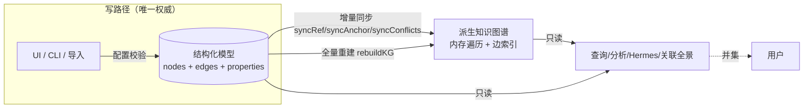
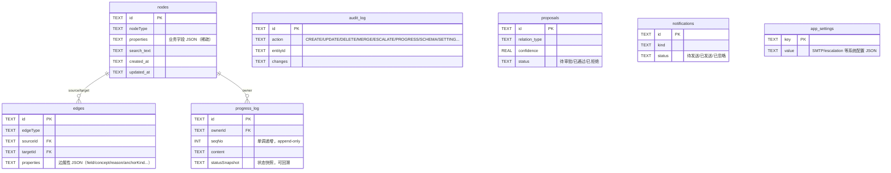

# 作战管理工具 — 后台核心数据模型设计

> 目的：让你完整理解当前后端核心设计，据此判断代码是否符合需求。
> 状态：对应已部署代码（增量 1–35）。本文描述**实际实现**，非规划。
> 配套：PRD.md（需求/验收依据）、req.md（原始需求参考）。

---

## 0. 一句话

**一个数据模型（稀疏、配置驱动、schemaless 属性存储）+ 多张作战表作为 view（投影）+ 派生知识图谱做跨 view 关联**。结构化层是唯一权威写入源；知识图谱由其派生、可随时重建；查询/分析用"传统查询 ∪ 知识图谱"并集呈现。

---

## 1. 混合数据模型（核心架构决策）



- **结构化模型 = Source of Truth**：所有写操作（建/改/删/合并/流转/手工关联）只走这里，配置驱动校验。
- **知识图谱 = 派生层**：从结构化数据自动同步或全量重建（`POST /api/kg/rebuild`），**不接受直接写**。用于跨 view 关联、多跳遍历、冲突检测、Hermes 问答、文档检索。
- **检索是并集**：`/api/related` 把结构化确定边 ∪ 模糊候选 ∪ 手工备注线 在一次响应里并集返回。

---

## 2. 物理存储（稀疏、无 DDL）

7 张表，业务字段全部装在 JSON 列，**增删字段零迁移**：



**稀疏性**：一条只填 3 个字段的记录，`properties` 就只有 3 个键，不为其它字段留空列。不同记录键集可完全不同。

---

## 3. 节点类型（nodeType，全部配置驱动）

15 个 nodeType = 15 份 `config/schemas/*.json`，加一张新作战表 = 加一份配置，**零后端代码**：

| 分类 | nodeType | 说明 |
|---|---|---|
| 攻关核心 | `attackTicket` | 攻关单（覆盖 req.md 详情全字段） |
| req.md 作战表 | `incidentTracking` `changeIssue` `alarmGovernance` `p3Incident` `dailyTask` `issue400` `issue5xx` | 7 张现网/变更/告警/事件/日常/梳理表 |
| 文档 | `experience` | 经验总结（供 Hermes 检索的 Document） |
| 荣誉 | `contribution` | 贡献记录 |
| 实体 | `person` | 人员（实体解析归一目标） |
| 归档 | `releasePackage` `weightFile` | 发布包 / 权重文件 |
| 运维 | `oncall` | Oncall 排班 |
| 通知 | `emailGroup` | 邮件群组 |

字段（FieldSchema）关键属性：`id`(稳定不变) / `label`(可改显示名) / `type`(string/number/date/datetime/enum/ref/sequence) / `required` / `enumValues` / `retired`(非破坏退休) / `aliases`(导入列归一) / `concept`(语义归并) / `anchor`(跨颗粒度锚点) / `refType`(ref 目标类型)。

---

## 4. 边类型（跨 view 关联的载体）

实际产生的 8 种边：

| 边类型 | 来源 | 触发机制 | 语义 |
|---|---|---|---|
| `REF` | 任意 → 实体 | `ref` 字段写入时 `syncRefEdges` | 字段引用（如 当前处理人→person），带 `field`/`concept` |
| `ANCHORED_TO` | 任意 → 锚点节点 | `anchor` 字段写入时 `syncAnchorEdges` | 共享最细锚点（问题单号/事件单号/domain/客户） |
| `CONTRIBUTED_TO` | contribution → 攻关单 | 贡献创建时 | 贡献回溯 |
| `ASSIGNED_TO` | 攻关单 → person | 导入攻关申请人 | 分配 |
| `ESCALATED_TO` | 攻关单 → person | SLA 扫描超期 | 上升（带 level/上升角色/at） |
| `CONFLICTS_WITH` | 攻关单 ↔ 攻关单 | `syncConflicts`（同负责人多活跃单） | 冲突（红色高亮，双向） |
| `OVERLAPS_WITH` | 攻关单 ↔ 攻关单 | `syncConflicts`（同问题单号） | 重叠（双向） |
| `RELATES_TO` | 任意 ↔ 任意 | **管理员手工拉线**（§52） | ad-hoc 备注关联线，带 `reason`/`sourceField`，不依赖 schema |

```mermaid
graph LR
  T[attackTicket 攻关单] -->|REF 当前处理人 concept=负责人| P[person]
  C[contribution 贡献] -->|REF 贡献人| P
  I[incidentTracking 现网问题] -->|REF 运维责任人| P
  T -->|ANCHORED_TO| A((问题单号锚点))
  I -->|ANCHORED_TO| A
  P3[p3Incident] -->|ANCHORED_TO| EV((事件单号锚点))
  T -->|ANCHORED_TO| EV
  C -->|CONTRIBUTED_TO| T
  T -. CONFLICTS_WITH .- T2[另一攻关单]
  T ==RELATES_TO 手工备注线== X[经验总结/任意记录]
  classDef anchor fill:#722ed1,color:#fff;
  class A,EV anchor;
```

**跨 view 互见的关键**：现网问题与攻关单填同一个问题单号 → 各自 `ANCHORED_TO` 同一锚点节点 → `/api/related` 的 `coAnchored` 让它们互相可见，**无需重复录入**。

---

## 5. 关联机制全景（规则 + 尽力而为 + 手工 + 并集）

```mermaid
flowchart TB
  subgraph 规则关联["① 规则关联（schema/配置驱动，显式）"]
    R1[ref 字段 → REF 边]
    R2[anchor 字段 → ANCHORED_TO + coAnchored]
    R3[concept → 异名同义归并]
    R4[syncConflicts → CONFLICTS/OVERLAPS]
  end
  subgraph 尽力而为["② 尽力而为（模糊 + 强制人审）"]
    F1[HeuristicProposer Levenshtein] --> F2[SAME_AS 候选]
    F2 --> F3{人工审批队列}
    F3 -->|通过| F4[mergePerson 实体合并]
  end
  subgraph 手工["③ 手工 ad-hoc（§52）"]
    M1[管理员对单条记录拉线 + 备注] --> M2[RELATES_TO 边入 KG]
  end
  规则关联 --> U[/api/related 并集]
  尽力而为 --> U
  手工 --> U
  U --> V[关联全景：outgoing/incoming + coAnchored + candidates 待审批 + manualLinks + 冲突 + depth-N 扩展]
```

- **实体解析优先级**：精确 ID（工号/邮箱）→ 别名 → 模糊（编辑距离）+人审 → 手动合并。Person 合并取并集字段、迁移边、不可逆、审计。
- **并集呈现**：`GET /api/related/:type/:id?includeCandidates=1&depth=N` 一次返回结构化边 ∪ 共享锚点 ∪ 待审批候选 ∪ 手工备注线 ∪ 冲突 ∪ 多跳扩展。

---

## 6. View = 投影 + 进展时间序列

- **View**：每个 nodeType 一个投影；取记录 `queryNodes(type[,filter])`，取字段由 EntitySchema 配置驱动动态渲染；同一稀疏底座，各 view 各显其字段。
- **多形态**：同一数据 表格 ↔ 卡片 切换；关联全景图；进展时间线。
- **进展**：`progress_log` append-only 序列 + 状态快照；状态流转（`/transition`）原子更新状态并追加一条带快照的进展，全程可回溯。
- **审计**：一切写操作进 `audit_log`。

---

## 7. 需求满足度自评（对照 PRD §11 / req.md）

| 需求 | 状态 | 证据 |
|---|---|---|
| 一模型多 view + 跨 view 关联（核心痛点：Excel 重复/查不到/关不上） | ✅ | 统一 nodes/edges，15 view，REF/锚点/concept/手工线 |
| 配置驱动 schema，UI 增减字段无 DDL | ✅ | properties JSON + PATCH /api/schema 回写配置 |
| 多源导入 + 同人跨表合并 | ✅ | 导入引擎(别名归一+dry-run) + 实体解析合并 |
| 攻关作战台（字段覆盖 req.md） | ✅ | attackTicket 含详情全字段（增量32） |
| 进展时间序列 + 可追溯 | ✅ | progress_log + 状态流转快照 + 审计 |
| 荣誉殿堂（加权榜/周期/个人档案/回溯） | ✅ | honor + CONTRIBUTED_TO |
| 派生 KG 全量重建 | ✅ | rebuildKG |
| 冲突检测红色高亮 | ✅ | syncConflicts + 关联页红区 |
| 实体解析（精确/别名/模糊人审/手动） | ✅ | refs + proposer + merge |
| Hermes 只读问答 + 文档检索 | ✅ | 8 意图 + experience 全文 |
| 自动日报 / 跟催/CCB/FE 提醒（李嘉①②③④⑤⑥） | ✅ | daily-report + reminders；发布包/权重归档 |
| SLA 上升 / 责任矩阵 / Oncall | ✅ | escalation + oncall |
| 通知通道 | 🟡 | Email ✅；eSpace/welinkcli 待凭据 |
| 手工 ad-hoc 关联 + 并集 | ✅ | RELATES_TO（增量35） |
| 全 API 命令行（供 agent） | ✅ | 43 CLI 命令 + help |
| 权限（贡献等级仅 Leader） | ✅(MVP) | X-Role 轻量门禁 |

**未满足/待输入**：welinkcli 抓群自动流入、eSpace 通道（需凭据）；定时器编排、日报发布数量自增、团队聚合、"动态发现未声明字段成列"（增强项，非验收项）。

---

## 8. 实际使用者场景分析

**场景：杨虹雨处理"开发环境频繁断连"攻关单**

1. 从「攻关作战台」建/导入攻关单，填问题单号 `OSM TS2026...`、事件单号 `2026...`、当前处理人=杨虹雨。
   → 系统自动：建 person(杨虹雨)、REF 边；建问题单号/事件单号锚点、ANCHORED_TO 边。
2. 运维同事在「现网问题跟踪」录了同一问题单号的记录。
   → 两条记录在各自「关联全景」里**自动互见**（coAnchored），不必重复沟通"这是同一个问题"。
3. 杨虹雨每天追加进展、状态从"进行中"流转到"已解决"。
   → 进展时间线可回溯；每次流转自动留快照 + 审计。
4. 攻关超过 P4A 的 4h SLA 未闭环。
   → `escalation:scan` 标记上升（ESCALATED_TO + 审计），可定时跑。
5. 杨虹雨想知道"谁能帮"。
   → 「找帮手」基于共享锚点/历史贡献推荐；或 Hermes 问"PB-xxx 找谁帮忙"。
6. 攻关完，Leader 在「贡献录入」记录各人贡献等级（普通角色被门禁，Leader 可标定）。
   → 荣誉殿堂加权榜单，可回溯到该攻关单。
7. 杨虹雨发现这次问题和半年前一条「经验总结」高度相关，但没有任何字段能自动关上。
   → **手工拉一条备注线**：attackTicket.标题 → 那条经验，备注"同类断连根因"。该线入 KG，下次任何人在关联全景都能看到。
8. 管理者用 Hermes/检索/大盘看全局态势；agent 用 CLI 批量操作。

**这个场景里 Excel 时代的痛点（同一问题散落多表、查不到帮手、贡献被忘、经验断层）逐一被覆盖。**

---

## 9. 可扩展性分析

| 维度 | 可扩展性 | 理由 |
|---|---|---|
| 新增作战表/字段 | ★★★★★ | 加/改一份 JSON 配置，零代码、零迁移；UI 运行时增减字段回写配置 |
| 新增关联语义 | ★★★★☆ | 边类型是数据（edges.edgeType 字符串），新增一种关联只需产边逻辑；手工 RELATES_TO 已支持任意 ad-hoc |
| 新增 view 形态 | ★★★★☆ | 表格/卡片已有；矩阵/看板/统计可加渲染器，数据层不变 |
| 接入新通知通道 | ★★★★☆ | MailSender 接口已抽象；eSpace/welink 实现该接口即插入 |
| Agent 自动化 | ★★★★★ | 全 API 有 CLI + help 自描述，agent 可自查自调 |
| 规模 | ★★★☆☆ | 千级节点 SQL+内存图足够；万级需引入图索引/分页（PRD §13#5 已记录） |
| 真实认证/权限 | ★★★☆☆ | 当前 X-Role 轻量门禁，可升级为登录态注入 X-Role，门禁逻辑不变 |
| 派生层替换 | ★★★★☆ | KG 是派生且可全量重建，未来换图数据库只需替换派生/遍历实现，写路径与契约不变 |

**结论**：架构的可扩展性来自三个解耦——(1) 业务字段与物理表解耦（JSON 属性）、(2) 关联语义与 schema 解耦（边即数据 + 手工线）、(3) 派生 KG 与权威写路径解耦。这三点保证"软件在使用中持续被改"时改得动，符合 PRD §0.4 的根本诉求。

主要风险/后续：规模上万需图索引；welinkcli/eSpace/真实登录需外部输入；"自动发现未声明字段"与定时编排是体验增强项。
